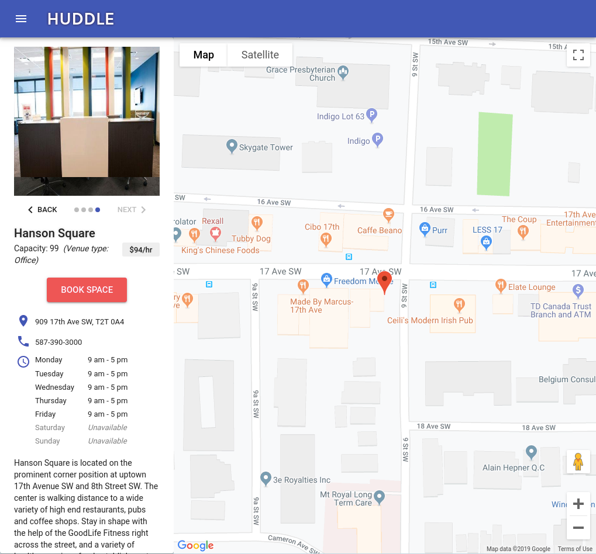

# HUDDLE

The quick pitch for HUDDLE is: "AirBnB for meeting spaces".

Whether it's a business meeting or a personal gathering, if you're looking for a space to... huddle, there's an app for that. ;)

The UI speaks for itself - it is cleanly designed, and fully responsive. 

Upon launch, the user is presented with a set of spaces. clicking on a space reveals further details about it, an image gallery, and a map with place-marker.

_The heart of the app is in its intelligent filtering and scoring mechanism._ When the user exposes the filtering controls, they are able to search for spaces based on several criteria:

* Rate : fee for space
* Capacity : party size
* Address : in case a particular street/area is desired
* City : if a particular city is desired (an additional quadrant-based filter is exposed when cities such as Calgary &amp; Edmonton are entered)
* Day of week : day(s) of the week desired, if any

As the user specifies filtering criteria, the set of spaces is scored and sorted in real-time, from highest to lowest scoring spaces. The scores are colour-coded as well for additional reinforcement &amp; feedback for the user.

This approach is far superior to a more traditional all or nothing search, where depending on one's search criteria, no matches may be found.

While there may not be a 100% match for the user's requirements, with the UI making the filtering criteria set clear, and the scoring system, it is very easy for the user to understand what spaces match their needs the best. It also makes it very easy for the user to gauge whether there are certain filter parameters they may not be as concerned with, in order to find a better match. 

The filtering/scoring system was developed using TDD in JS, and was written in a very general way, such that it would be very easy to add additional filtering criteria.

__While this app deals with meeting spaces, the problem that has been solved here is a general one with broad applicability:__ how to intelligently filter and score a set of objects based on an extensible set of criteria.

&nbsp;

__View on launch, filtering controls hidden:__

&nbsp;

__Filtering controls exposed:__

&nbsp;

__As search criteris are set, spaces are scored and re-sorted:__

&nbsp;

__Details view for a space:__

